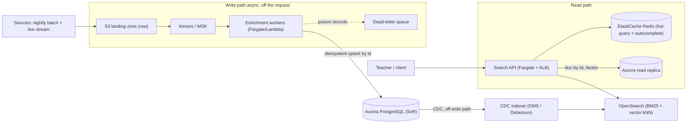
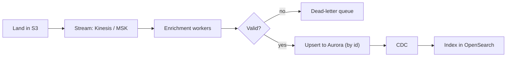
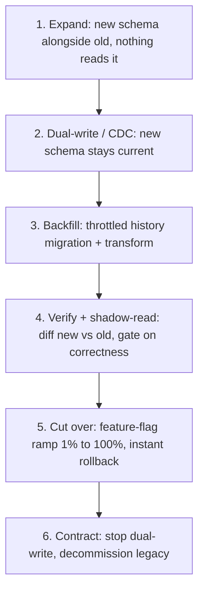

# Target Production Architecture

Scope: evolving this MVP to **millions of documents**, **high concurrent
traffic**, and **continuous, automated daily ingestion** in a production AWS
environment — with a **zero-downtime** path off the legacy 10-year-old schema.

The MVP intentionally stays in PostgreSQL. This document describes where that
stops being enough, what replaces it, and *why* — and how each step maps back to
patterns the MVP already uses (idempotent upsert keyed on `id`, ingest-time
normalization into `facets`, generated search columns that keep the index in
sync on every write).

## TL;DR

**The one idea:** Postgres stays the system of record; the search index is a
*derived, rebuildable* read model. Every decision below falls out of that.

**Scalability.** Three axes scale independently so a traffic spike, a data-volume
milestone, and a relevance need never force the same upgrade. *Search* graduates
in tiers — Postgres FTS → Redis cache for the hot query head → OpenSearch (BM25 +
vector kNN) only when relevance, write/read CPU contention, or hybrid retrieval
demands it. *Storage* is Aurora (writer + read replicas) with RDS Proxy for
connection scaling and partitioning at tens of millions of rows. *Ingestion*
decouples producers from consumers via a queue (Kinesis/MSK): S3 landing →
stream → idempotent enrichment workers → Aurora upsert. **Daily additions never
degrade live search because indexing is asynchronous and off the request path**
(CDC from Aurora), with bulk reindexes built on a new index and promoted by an
atomic alias swap.

**Zero-downtime migration.** Expand/contract (parallel-change): stand up the new
schema, keep it current via DMS full-load + CDC from the legacy DB, backfill
history in throttled idempotent chunks (applying the normalization transform),
verify with checksums + shadow-read diffs, then cut over behind a feature flag
ramped 1% → 100% with instant rollback, and finally decommission the legacy
schema. The legacy system serves traffic unchanged until a reversible flag flip —
no deploy, no downtime.

The rest of this document expands each point with the *why* and the AWS mapping.

## Guiding invariant

**Postgres is the system of record; the search index is a derived, rebuildable
read model.** Everything below follows from that single separation. If the
search tier is ever wrong, stale, or lost, it can be rebuilt from Postgres. That
is what makes reindexing, engine swaps, and the schema migration safe — none of
them are one-way doors.

In the MVP this invariant is literal: `search_vector` / `search_text` are
`GENERATED ALWAYS … STORED` columns derived from the row. In production the
derived index simply moves out of Postgres and into OpenSearch, fed
asynchronously — but the relationship is identical.

---

## Scalability

The system scales along three independent axes — **search serving**,
**storage**, and **ingestion** — so each can grow (and be paid for) on its own
curve. Decoupling them is the whole point: a traffic spike, a data-volume
milestone, and a relevance requirement should never force the same upgrade.

### 1. Search logic

Search graduates in tiers; you only pay for the next tier when a concrete signal
forces it.

| Stage | Scale / trigger | Approach |
| --- | --- | --- |
| Today (MVP) | ≤ ~1–2M rows, modest QPS | Postgres FTS (GIN) + trigram fallback |
| + Cache | Read-heavy, repeated queries | ElastiCache (Redis) in front of search |
| OpenSearch | Relevance/volume signals below | Derived BM25 + vector kNN index |

**Postgres FTS holds up well past the MVP** — into the low millions of rows with
a GIN index, *especially* behind a cache for the head of the query distribution
(a small fraction of distinct queries serve most traffic). Graduate to
**OpenSearch** only when one of these bites:

- **Relevance** needs fuzzy + semantic + faceted ranking that is awkward or slow
  in SQL (faceted aggregations, per-field boosting, synonyms, language analyzers
  managed as data rather than DDL).
- **Contention**: query volume saturates the primary's CPU, and search scans
  start competing with transactional writes on the same instance.
- **Hybrid retrieval**: you want lexical BM25 *and* dense-vector kNN over
  embeddings, fused with reciprocal rank fusion (RRF) — the standard recipe for
  "find it even when the words don't match."

**Scaling OpenSearch:** keep it strictly derived (rebuildable from Aurora).
Shard by volume with per-language analyzers; run dedicated coordinating/master
nodes; scale data nodes horizontally; serve reads from replicas. Bulk reindexes
write to a **new index** that is swapped in atomically via an **alias** — the
serving alias never points at a half-built index.

**Why a cache (Redis):** search traffic is Zipfian — caching the hot query head
collapses p99 latency and shields the search tier from thundering herds. It also
backs **autocomplete**, which is latency-critical and extremely repetitive.

### 2. Data storage

- **Aurora PostgreSQL** is the system of record: a single writer plus **read
  replicas**. Auto-scaling storage, fast replica spin-up, and snapshot/restore
  make it the low-risk choice over self-managed RDS.
- **Read/write split:** queries that don't need the search engine — document-by-
  id, facet lookups, admin views — hit **read replicas**, keeping the writer
  free for ingestion upserts.
- **Connection management:** at high concurrency, Postgres connection limits
  become the bottleneck before CPU does. Put **RDS Proxy** (or PgBouncer) in
  front so thousands of API/worker connections multiplex onto a bounded pool —
  the MVP already centralizes this in `src/db.ts` (`pg.Pool`), so this is a swap,
  not a rewrite.
- **Partitioning:** at tens of millions of rows, partition `documents` (e.g. by
  `created_at` range or subject) so vacuum, index maintenance, and large
  backfills stay bounded.
- **Embeddings:** live with the document via **pgvector** (when ranking happens
  in Postgres) or inside OpenSearch (when ranking happens there). Either way they
  are generated once on the write path, never per query.
- **Large/binary assets** (preview images, source files) live in **S3**, with
  only URLs/metadata in the database.

### 3. Ingestion pipeline

Decouple producers from consumers with a **queue/stream** (**Kinesis** for
managed simplicity, **MSK/Kafka** for higher throughput and replay). The nightly
batch and any live stream flow through the **same enrichment path** — there is
one way data enters the system, which is what keeps it testable and idempotent.

Workers:

1. **Validate** (the MVP's `zod` schema becomes the worker contract; tolerant
   parsing of messy legacy values like epoch-ms `created_at` already lives in
   `src/schema.ts`).
2. **Normalize the messy metadata** — the canonical subject taxonomy
   (`reli`/`religion`/`ethik` → one subject), grade normalization, de-slugged
   tags. This is exactly what `src/normalize.ts` (`enrichFacets`) does today,
   promoted from an inline call to a pipeline stage.
3. Optionally **generate embeddings**.
4. **Upsert to Aurora keyed on `id`** — identical semantics to the MVP's
   `upsertDocuments`.

**Idempotency + DLQ:** consumers are idempotent (upsert by `id`, so replays and
at-least-once delivery are safe) and route poison records to a **dead-letter
queue** for inspection, so one bad record or batch degrades gracefully instead
of stalling the pipeline. Failed batches are replayable from S3/the stream.

**Autoscaling + backpressure:** workers scale on queue depth / consumer lag.
The queue absorbs spikes (a 5M-row nightly drop becomes a smooth drain, not a
write storm), and applies natural backpressure so ingestion never overwhelms
Aurora or the indexer.

### Continuous daily additions without degrading live search

This is the crux of the requirement, and it is answered by **one rule:
indexing is asynchronous and off the request path.**

- The request (or batch job) that ingests data only writes to **Aurora** and
  returns. It never blocks on indexing.
- A **CDC stream** (Debezium → Kafka, or AWS DMS) tails Aurora's WAL and feeds
  the indexer downstream. Live search queries are completely unaware that
  ingestion is happening.
- **Two lanes, isolated:**
  - *Incremental* — daily/continuous deltas trickle into the live index via CDC
    at low, steady volume.
  - *Bulk* — full reindexes / large backfills write to a **separate new index**
    and are promoted with an **atomic alias swap**. The live index is never
    rebuilt in place, so a reindex can't degrade serving.
- **Tune for it:** OpenSearch refresh interval and bulk sizing are set so
  indexing throughput doesn't steal CPU from queries; replica count is sized for
  read concurrency independently of write load.

A direct contrast with the MVP: the MVP's migration `003` adds a `STORED`
generated column, which rewrites the whole table under a lock — fine at 10k,
unacceptable at millions. In production that work is exactly what moves to the
async CDC + alias-swap path so it never touches live latency. (See the migration
section for how schema changes themselves get the same treatment.)

---

## Zero-downtime migration (legacy → target schema)

The dataset is a snapshot of a 10-year-old application, so the migration has two
jobs at once: **move the data** (legacy DB → Aurora) and **transform the schema**
(messy legacy shape → clean target with canonical facets). Both run under
**expand/contract (parallel-change)** so reads and writes never stop.

1. **Expand.** Stand up the new schema (and Aurora) alongside the legacy
   database. Nothing reads it yet, so there is zero user-visible risk.

2. **Dual-write / CDC capture.** Make the new schema current *from this moment
   on*, via whichever is less invasive:
   - **CDC from the legacy DB** (preferred — no legacy code change): **AWS DMS**
     does a **full load + ongoing change-data-capture**, so the source stays
     fully writable throughout and every new legacy write is replicated forward.
   - **Application dual-write** where DMS can't express the transform — the app
     writes both shapes, with the new write best-effort and reconciled by
     backfill so a new-path failure never breaks the live legacy path.

3. **Backfill + transform.** Batch-migrate history in **throttled, idempotent
   chunks** (keyed on `id`, exactly like `upsertDocuments`), applying the
   normalization rules during the copy (subject canonicalization, grade parsing,
   tag de-slugging, `created_at` coercion). Throttling keeps backfill from
   starving live traffic; idempotency means an interrupted backfill just resumes.
   Run until old and new **converge**.

4. **Verify + shadow-read.** Reconcile with **row counts and checksums** per
   partition to prove completeness. Then run the **new query path in the
   background** (shadow reads): for live queries, execute against both schemas,
   **diff the results, and measure divergence** — without showing the new path
   to any user. This is the correctness gate; relevance/ranking differences are
   caught here, not in production.

5. **Cut over.** Flip reads behind a **feature flag**, **ramped 1% → 10% → 100%**
   with metrics watched at each step and **instant rollback** (flip the flag
   back) if error rate, latency, or zero-result rate regress. No deploy, no
   downtime — just a config change.

6. **Contract.** Once the new path serves 100% cleanly for a soak period, stop
   dual-writing/CDC, drop the compatibility shims, and decommission the legacy
   schema.

**Why this is zero-downtime:** the legacy system serves reads and accepts writes
unchanged until the instant of cutover, cutover is a reversible flag flip rather
than a deploy, and correctness is proven by shadow diffs *before* any user is
exposed. The same machinery (CDC tailing Aurora, build-new-index-then-alias-swap)
is reused for ongoing schema evolution after launch — schema changes become
routine, not events.

---

## Phased evolution (MVP → target)

Each phase is independently shippable and triggered by a real signal, not a
calendar.

1. **Decouple ingest.** Put `POST /api/documents` behind SQS/Kinesis; the
   existing `upsertDocuments` becomes the consumer. (Add auth on the endpoint.)
2. **Land + replay.** Add the S3 landing zone and DLQ; nightly batch lands in S3
   and drains through the same consumer.
3. **Read scaling.** Add Aurora read replicas + RDS Proxy; route doc-by-id and
   facet reads to replicas; add Redis for the hot-query head.
4. **Search tier.** Stand up OpenSearch as a derived index via CDC; shadow-read
   against Postgres FTS; cut over behind a flag (same mechanism as the schema
   migration).
5. **Relevance.** Add embeddings + vector kNN and RRF hybrid ranking, justified
   by the observability metrics below.

## AWS mapping

| Concern | Service | Why |
| --- | --- | --- |
| System of record | Aurora PostgreSQL (writer + read replicas) | Managed HA, fast replicas, snapshot/restore |
| Connection pooling | RDS Proxy | Multiplex high client concurrency onto bounded connections |
| Search serving | OpenSearch Service (BM25 + kNN) | Faceted + semantic relevance, horizontal shards |
| Raw landing zone | S3 | Cheap, durable, replayable source of truth for ingestion |
| Ingestion / CDC transport | Kinesis or MSK; DMS for the legacy migration | Decouple producers/consumers, absorb spikes, replay |
| Enrichment / indexer workers | Fargate or Lambda | Autoscale on queue depth; idempotent consumers |
| Hot-query + autocomplete cache | ElastiCache (Redis) | Collapse p99 on the Zipfian query head |
| API | Fargate behind an ALB | Stateless, horizontally scalable |
| Feature flags | AppConfig / LaunchDarkly | Ramped, reversible cutovers |

## Observability

Treat search quality as a measured product surface, not a vibe. Log and alert on:

- **Zero-result rate** — the single best signal that relevance or normalization
  is failing users.
- **Click-through / result selection** — did we rank the right thing?
- **p99 latency** (API, cache hit/miss, search tier) and **per-query result
  counts**.
- **Pipeline health** — consumer lag, DLQ depth, CDC replication lag (how stale
  the index is vs the SoR).

This telemetry is what *justifies* the next investment: it tells you when to add
the cache, when FTS contention warrants OpenSearch, and whether a relevance
change (or the migration cutover) actually helped or hurt — turning every step
above from a guess into a measured decision.
